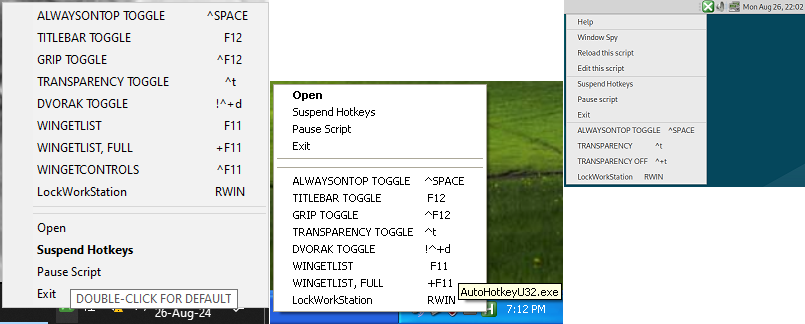

# AutoHotkey
- [Installation](#installation)
- [App Startup @Boot](#app-startup-boot)
- [App Versions](#app-versions)
- [Latest Updates](#latest-updates)

For Windows/Linux dvorak users! Built for Windows (ahk-v2), Linux (v1.0) & Windows XP (v1.1).  There's LockWorkStation `RWIN`, transparency toggle `#t`, rename `!r`, explorer `!e`, duplicate `^d`, Dvorak toggle `^!+d`, AlwaysOnTop toggle `^SPACE`, suspend/pause toggle `^!SPACE`, TitleBar toggle `F12`, grip toggle `^F12`, window-list `F11` & ControlList `^F11`.  The linux version is missing some of that (see tray menus).  

These scripts emulate CTRL with ALT, so copy/paste can be done with left thumb. My left pinky is a bit awkward - it broke @school when I was young.

## Installation
- On Windows use either `AutoHotkey64.ahk` or `AutoHotkey64.exe`.  The system keyboard should be QWERTY.  App is 1MiB.  AHK easily maps dvorak all by itself.
- On Windows XP use either `AutoHotkeyU32.ahk` or `AutoHotkeyU32.exe`.  App is 1MiB.
- On Linux use either `ahk_x11.ahk` or `ahk_x11.AppImage`.  The system keyboard should be dvorak.  App is 33MiB. If it doesn't run, grant it the allow executing the file as program permission.

All builds are easily reproducible. To use the scripts directly requires putting them alongside the [official](https://autohotkey.com) executable & double-clicking on it (`AutoHotkey64.exe`). Official `ahk_x11.AppImage` is [here](https://github.com/phil294/AHK_X11/releases).

Also create a shortcut on the desktop to the executable. Right-click→Send to→Desktop. 

To use as admin in Windows 10, right-click on the shortcut→Properties→Compatibility→Run this program as an administrator→OK.

## App Startup @Boot
- To boot with Windows 10, copy the shortcut to hidden folder: `C:\Users\username\AppData\Roaming\Microsoft\Windows\Start Menu\Programs`. I created a library for it, & I also moved my Roaming folder to a different drive.
- To boot with Windows XP, drag & drop shortcut onto start→All Programs→Startup.  It's the easiest!
- To boot with Linux, configure System→Preferences→Personal→Startup Applications→Add→Browse→ahk_x11.AppImage→Open.

## App Versions
- AutoHotkey64 is for v2.0.18.
- AutoHotkeyU32 is for v1.1.37.02.  Simpler script than v2.
- ahk_x11-1.0.4 is for v1.0.24, from 2004!  Simplest script.

## Latest Updates
The above scripts & executables haven't been properly released.  I want a new script for Windows 98 first.
- `F11` & `+F11` window-lists for Linux.
- PAUSE removed from `^!SPACE` toggle.
